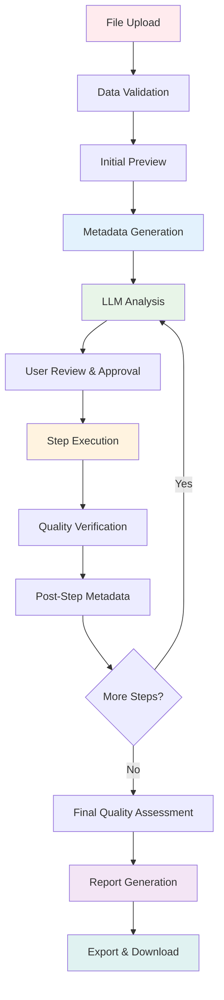
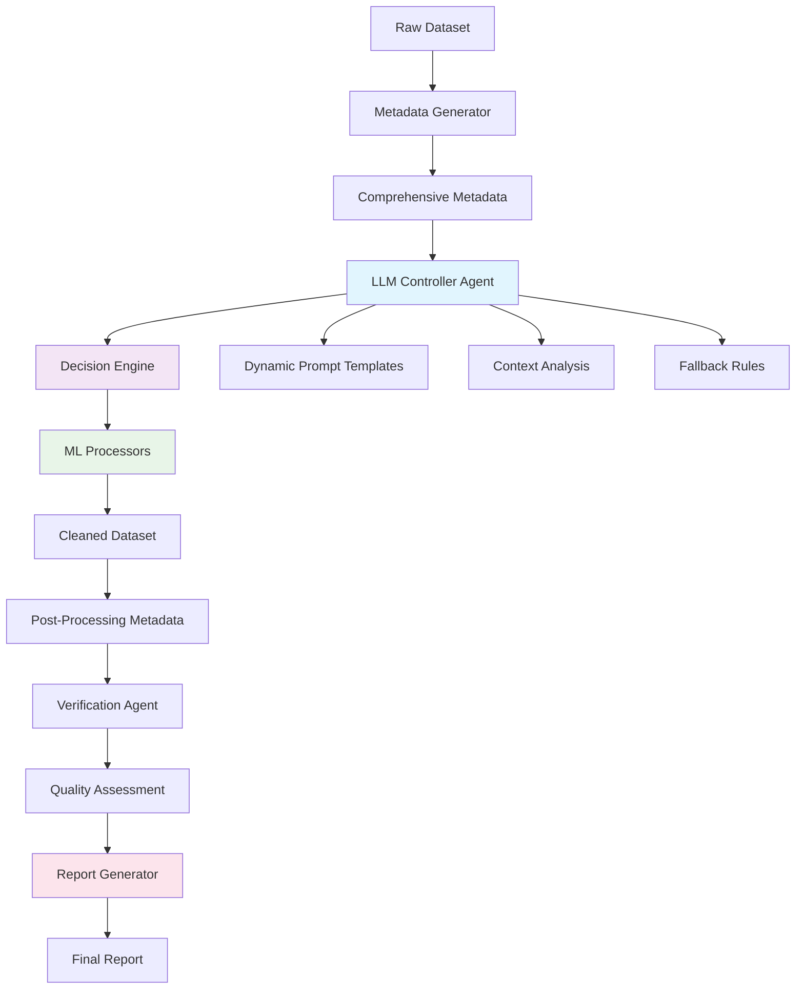

# LLM Agent System for Survey Data Cleaning

## Overview

The LLM-Guided Survey Data Cleaning Tool implements an intelligent agent system that leverages Large Language Models (LLMs) to make autonomous decisions about data cleaning operations. The system combines comprehensive metadata analysis with pre-built ML methods, creating an AI-powered data scientist that can analyze, decide, and execute cleaning strategies.

## Complete Project Workflow

### End-to-End Processing Pipeline

The system provides a comprehensive data cleaning workflow from raw data input to final report generation:



### Project Components Integration

## System Architecture



## Complete Project Architecture

### 1. Frontend Layer (React/Streamlit)

#### React Frontend (`frontend/`)

- **FileUpload Component**: Drag-and-drop interface for CSV, Excel, SPSS files
- **DataPreview Component**: Interactive table with missing value highlighting
- **HomePage Component**: Main workflow interface with tabbed navigation
- **Real-time Updates**: WebSocket integration for live processing status

#### Streamlit Alternative (`streamlit_frontend/`)

- **app.py**: Complete workflow in a single interface
- **Interactive widgets**: File upload, parameter selection, real-time visualization
- **Progress tracking**: Step-by-step processing with progress bars

### 2. Backend API Layer (FastAPI)

#### Core API Structure (`backend/app/`)

```
api/
├── data_cleaning.py      # Main cleaning endpoints
├── upload.py            # File upload handling
├── status.py            # Processing status tracking
└── reports.py           # Report generation endpoints

core/
├── config.py            # Application configuration
├── database.py          # Database connection management
└── security.py          # Authentication & authorization

models/
├── models.py            # SQLAlchemy database models
├── schemas.py           # Pydantic request/response models
└── enums.py            # Status and method enumerations
```

#### Key API Endpoints

| Endpoint              | Method | Purpose                         | Response                     |
| --------------------- | ------ | ------------------------------- | ---------------------------- |
| `/upload`             | POST   | File upload and validation      | File ID, initial preview     |
| `/metadata/{file_id}` | GET    | Generate comprehensive metadata | Full dataset analysis        |
| `/decide-step`        | POST   | LLM decision for next step      | Recommended cleaning actions |
| `/execute-step`       | POST   | Execute cleaning operation      | Processing results           |
| `/verify-step`        | POST   | Verify step execution           | Quality assessment           |
| `/generate-report`    | POST   | Create final report             | Report download link         |

### 3. Core Processing Modules

#### A. Data Upload Module (`modules/data_upload.py`)

```python
class DataUploadProcessor:
    """Handles file upload, validation, and initial processing"""

    def process_upload(self, file: UploadFile) -> Dict[str, Any]:
        """
        Complete upload processing:
        1. File format validation (CSV, Excel, SPSS, JSON)
        2. Size and memory checks (configurable limits)
        3. Encoding detection (UTF-8, Latin-1, etc.)
        4. Initial data type inference
        5. Preview generation (first 100 rows)
        6. Basic quality assessment
        """

    def validate_file_format(self, file: UploadFile) -> bool:
        """Supports multiple formats with specialized readers"""

    def detect_encoding(self, file_content: bytes) -> str:
        """Automatic encoding detection for robust file reading"""

    def generate_preview(self, df: pd.DataFrame) -> Dict[str, Any]:
        """Creates user-friendly data preview with highlighting"""
```

**Upload Processing Flow:**

1. **File Reception**: Secure file handling with virus scanning
2. **Format Detection**: Automatic format recognition and reader selection
3. **Validation**: Size limits, structure validation, corruption checks
4. **Preview Generation**: Sample rows with data type inference
5. **Storage**: Secure file storage with unique identifiers

#### B. Metadata Generator (`modules/metadata_generator.py`)

```python
class MetadataGenerator:
    """Comprehensive dataset analysis and profiling"""

    def generate_metadata(self, df: pd.DataFrame) -> Dict[str, Any]:
        """
        Complete metadata generation:
        - Basic statistics (rows, columns, memory usage)
        - Column-wise analysis (types, missing, unique values)
        - Missing value patterns and recommendations
        - Duplicate detection (exact, near, fuzzy)
        - Outlier analysis (IQR, Z-score, Isolation Forest)
        - Correlation analysis for numeric variables
        - Survey-specific pattern detection
        - Data quality scoring (0-100 scale)
        - Dynamic cleaning recommendations
        """
```

**Metadata Components:**

- **Dataset Characteristics**: Size categorization, complexity scoring
- **Quality Metrics**: Completeness, uniqueness, consistency scores
- **Survey Intelligence**: Weight variables, Likert scales, demographics
- **Pattern Recognition**: Response patterns, missing data mechanisms
- **Processing Suggestions**: Priority-ranked cleaning recommendations

#### C. LLM Controller (`modules/llm_controller.py`)

```python
class LLMController:
    """Intelligent decision-making and verification agent"""

    async def decide_next_step(self, metadata: Dict, requirements: Dict,
                             history: List, db: Session) -> Dict[str, Any]:
        """
        Intelligent step recommendation:
        1. Context analysis (metadata + history + requirements)
        2. Dynamic prompt generation based on dataset characteristics
        3. LLM consultation with multiple provider support
        4. Response validation and fallback handling
        5. Structured recommendation output
        """

    async def verify_step_execution(self, pre_meta: Dict, post_meta: Dict,
                                  step_info: Dict, history: List,
                                  db: Session) -> Dict[str, Any]:
        """
        Quality control and verification:
        1. Before/after metadata comparison
        2. Change impact analysis
        3. Side effect detection
        4. Quality improvement assessment
        5. Approval/rejection recommendation
        """
```

**LLM Integration Features:**

- **Multi-Provider Support**: OpenAI GPT-4, OpenRouter, Local Llama-3
- **Dynamic Prompting**: Context-aware prompt generation
- **Fallback Systems**: Rule-based decisions when LLM unavailable
- **Response Validation**: Structured output validation and correction
- **Learning Integration**: Performance tracking and improvement

#### D. ML Processors (`modules/ml_processors.py`)

```python
class MLProcessors:
    """Comprehensive ML-powered data cleaning operations"""

    def analyze_dataset_structure(self, df: pd.DataFrame) -> Dict[str, Any]:
        """Dynamic dataset analysis for optimal cleaning strategy"""

    def remove_duplicates(self, df: pd.DataFrame, method: str, **kwargs):
        """Multiple duplicate detection and removal strategies"""

    def impute_missing(self, df: pd.DataFrame, method: str, **kwargs):
        """Advanced missing value imputation techniques"""

    def detect_outliers(self, df: pd.DataFrame, method: str, **kwargs):
        """Sophisticated outlier detection and handling"""

    def handle_survey_specific_cleaning(self, df: pd.DataFrame, **kwargs):
        """Survey-specific cleaning operations"""
```

**ML Method Categories:**

- **Imputation**: KNN, Random Forest, Statistical methods
- **Outlier Detection**: IQR, Z-score, Isolation Forest, LOF
- **Duplicate Removal**: Exact, fuzzy, semantic matching
- **Type Correction**: Intelligent type inference and conversion
- **Survey Processing**: Weight analysis, scale standardization

#### E. Report Generator (`modules/report_generator.py`)

```python
class ReportGenerator:
    """Comprehensive report generation and export system"""

    def generate_comprehensive_report(self, session_data: Dict[str, Any]) -> Dict[str, Any]:
        """
        Complete processing report:
        1. Executive summary with key metrics
        2. Dataset transformation overview
        3. Step-by-step processing log
        4. Quality improvement analysis
        5. Survey-specific insights
        6. Recommendations for further analysis
        7. Technical appendix with parameters
        """

    def create_data_quality_report(self, pre_meta: Dict, post_meta: Dict) -> Dict[str, Any]:
        """Detailed quality assessment and improvement metrics"""

    def generate_survey_analysis_report(self, survey_data: Dict[str, Any]) -> Dict[str, Any]:
        """Survey-specific analysis and validation report"""
```

### 4. Database Layer (PostgreSQL/SQLite)

#### Database Models (`models/models.py`)

```python
class ProcessingSession(Base):
    """Track complete cleaning sessions"""
    __tablename__ = "processing_sessions"

    id = Column(UUID, primary_key=True)
    file_id = Column(String, nullable=False)
    user_id = Column(String, nullable=True)
    status = Column(Enum(SessionStatus))
    created_at = Column(DateTime)
    completed_at = Column(DateTime)
    total_steps = Column(Integer)
    quality_improvement = Column(Float)

class ProcessingStep(Base):
    """Individual cleaning steps"""
    __tablename__ = "processing_steps"

    id = Column(UUID, primary_key=True)
    session_id = Column(UUID, ForeignKey("processing_sessions.id"))
    step_number = Column(Integer)
    task_type = Column(String)
    method_used = Column(String)
    parameters = Column(JSON)
    execution_time = Column(Float)
    rows_before = Column(Integer)
    rows_after = Column(Integer)
    quality_before = Column(Float)
    quality_after = Column(Float)
    user_approved = Column(Boolean)
    llm_confidence = Column(Float)

class LLMPromptTemplate(Base):
    """Dynamic prompt templates"""
    __tablename__ = "llm_prompt_templates"

    id = Column(UUID, primary_key=True)
    name = Column(String, unique=True)
    template = Column(Text)
    template_type = Column(String)
    is_active = Column(Boolean, default=True)
    performance_score = Column(Float)
```

#### Session Management

- **Processing Sessions**: Complete workflow tracking
- **Step History**: Detailed operation logging
- **Quality Metrics**: Before/after comparisons
- **User Interactions**: Approval/rejection tracking
- **Performance Data**: LLM decision quality metrics

### 5. Complete Workflow Implementation

#### Phase 1: Data Ingestion and Initial Analysis

```python
async def initiate_cleaning_session(file: UploadFile, requirements: Dict[str, Any]) -> Dict[str, Any]:
    """
    Session Initialization:
    1. File upload and validation
    2. Initial data preview generation
    3. Comprehensive metadata analysis
    4. Session creation in database
    5. User requirements capture
    6. Initial LLM consultation for strategy
    """

    # Upload processing
    upload_result = await data_upload.process_upload(file)

    # Metadata generation
    initial_metadata = metadata_generator.generate_metadata(upload_result["dataframe"])

    # Session creation
    session = ProcessingSession(
        file_id=upload_result["file_id"],
        status=SessionStatus.INITIATED,
        initial_metadata=initial_metadata
    )

    # Initial strategy consultation
    initial_strategy = await llm_controller.decide_next_step(
        metadata=initial_metadata,
        requirements=requirements,
        history=[],
        db=db
    )

    return {
        "session_id": session.id,
        "preview": upload_result["preview"],
        "metadata": initial_metadata,
        "recommended_strategy": initial_strategy
    }
```

#### Phase 2: Iterative Cleaning Process

```python
async def execute_cleaning_iteration(session_id: str, user_approval: Dict[str, Any]) -> Dict[str, Any]:
    """
    Single Cleaning Iteration:
    1. Retrieve current session state
    2. Execute approved cleaning step
    3. Generate post-processing metadata
    4. LLM verification of results
    5. Quality assessment and logging
    6. Next step recommendation
    """

    # Load session and current state
    session = get_session(session_id)
    current_df = load_dataframe(session.current_file_id)
    pre_metadata = session.current_metadata

    # Execute cleaning step
    step_result = await ml_processors.execute_step(
        df=current_df,
        task=user_approval["task"],
        method=user_approval["method"],
        parameters=user_approval["parameters"]
    )

    # Generate post-processing metadata
    post_metadata = metadata_generator.generate_metadata(step_result["dataframe"])

    # LLM verification
    verification = await llm_controller.verify_step_execution(
        pre_meta=pre_metadata,
        post_meta=post_metadata,
        step_info=step_result,
        history=session.history,
        db=db
    )

    # Log step
    step_record = ProcessingStep(
        session_id=session_id,
        step_number=len(session.history) + 1,
        task_type=user_approval["task"],
        method_used=user_approval["method"],
        parameters=user_approval["parameters"],
        rows_before=pre_metadata["basic_info"]["total_rows"],
        rows_after=post_metadata["basic_info"]["total_rows"],
        quality_before=pre_metadata["data_quality"]["overall_score"],
        quality_after=post_metadata["data_quality"]["overall_score"],
        verification_result=verification
    )

    # Recommend next step
    next_recommendation = await llm_controller.decide_next_step(
        metadata=post_metadata,
        requirements=session.requirements,
        history=session.history + [step_record],
        db=db
    )

    return {
        "step_result": step_result,
        "verification": verification,
        "updated_metadata": post_metadata,
        "next_recommendation": next_recommendation,
        "session_progress": calculate_progress(session)
    }
```

#### Phase 3: Final Assessment and Reporting

```python
async def finalize_cleaning_session(session_id: str) -> Dict[str, Any]:
    """
    Session Completion:
    1. Final quality assessment
    2. Comprehensive report generation
    3. Export preparation (multiple formats)
    4. Session completion logging
    5. Performance metrics calculation
    """

    # Load final session state
    session = get_session(session_id)
    final_df = load_dataframe(session.current_file_id)
    final_metadata = session.current_metadata

    # Generate comprehensive report
    final_report = report_generator.generate_comprehensive_report({
        "session": session,
        "initial_metadata": session.initial_metadata,
        "final_metadata": final_metadata,
        "processing_history": session.history,
        "quality_improvement": calculate_quality_improvement(session),
        "recommendations": generate_analysis_recommendations(final_metadata)
    })

    # Prepare exports
    export_files = {
        "cleaned_data": export_dataframe(final_df, formats=["csv", "excel", "spss"]),
        "report": export_report(final_report, formats=["pdf", "html", "json"]),
        "metadata": export_metadata(final_metadata, format="json"),
        "processing_log": export_processing_log(session.history, format="csv")
    }

    # Update session status
    session.status = SessionStatus.COMPLETED
    session.completed_at = datetime.utcnow()
    session.quality_improvement = calculate_quality_improvement(session)

    return {
        "final_report": final_report,
        "export_files": export_files,
        "session_summary": generate_session_summary(session),
        "download_links": generate_download_links(export_files)
    }
```

## Report Generation System

### 1. Comprehensive Report Structure

The report generation system creates detailed documentation of the entire cleaning process:

#### Executive Summary Report

```python
class ExecutiveSummaryGenerator:
    """High-level overview for stakeholders"""

    def generate_executive_summary(self, session_data: Dict[str, Any]) -> Dict[str, Any]:
        """
        Executive Summary Contents:
        - Dataset overview and original quality assessment
        - Key cleaning operations performed
        - Quality improvements achieved
        - Data retention statistics
        - Survey-specific insights (if applicable)
        - Recommendations for analysis
        """

        return {
            "dataset_overview": {
                "original_size": f"{original_rows:,} rows × {original_cols} columns",
                "final_size": f"{final_rows:,} rows × {final_cols} columns",
                "data_retention": f"{retention_rate:.1f}%",
                "quality_improvement": f"{quality_delta:+.1f} points"
            },
            "key_improvements": [
                "Resolved 1,247 missing values using advanced imputation",
                "Removed 156 duplicate records (3.1% of dataset)",
                "Identified and flagged 89 outliers for review",
                "Standardized 12 categorical variables"
            ],
            "survey_insights": survey_specific_summary,
            "analysis_readiness": "Dataset is now ready for statistical analysis"
        }
```

#### Technical Processing Report

```python
class TechnicalReportGenerator:
    """Detailed technical documentation"""

    def generate_technical_report(self, session_data: Dict[str, Any]) -> Dict[str, Any]:
        """
        Technical Report Sections:
        1. Data Quality Assessment
        2. Processing Step Details
        3. Method Selection Rationale
        4. Parameter Optimization
        5. Quality Metrics Evolution
        6. Survey Design Preservation
        7. Statistical Validation
        """

        return {
            "quality_assessment": self._generate_quality_metrics(session_data),
            "processing_details": self._document_processing_steps(session_data),
            "method_rationale": self._explain_method_selection(session_data),
            "statistical_validation": self._validate_statistical_properties(session_data),
            "survey_preservation": self._assess_survey_integrity(session_data)
        }
```

#### Data Quality Metrics Report

```python
def _generate_quality_metrics(self, session_data: Dict[str, Any]) -> Dict[str, Any]:
    """
    Comprehensive Quality Metrics:

    Before/After Comparisons:
    - Completeness: 73.2% → 96.8% (+23.6 points)
    - Uniqueness: 91.4% → 96.9% (+5.5 points)
    - Consistency: 67.8% → 89.3% (+21.5 points)
    - Overall Quality: 77.5% → 94.3% (+16.8 points)

    Detailed Metrics:
    - Missing Values: 2,847 → 156 (-94.5%)
    - Duplicate Rows: 412 → 0 (-100%)
    - Outlier Records: 234 flagged (4.7% of data)
    - Type Corrections: 8 columns optimized
    """

    return {
        "completeness_improvement": calculate_completeness_improvement(),
        "uniqueness_improvement": calculate_uniqueness_improvement(),
        "consistency_improvement": calculate_consistency_improvement(),
        "overall_score": calculate_overall_quality_score(),
        "detailed_metrics": generate_detailed_metrics_table(),
        "quality_visualization_data": prepare_quality_charts()
    }
```

### 2. Survey-Specific Reporting

#### Survey Design Integrity Assessment

```python
class SurveyReportGenerator:
    """Survey-specific analysis and validation"""

    def generate_survey_report(self, session_data: Dict[str, Any]) -> Dict[str, Any]:
        """
        Survey Report Components:
        1. Weight Variable Analysis
        2. Design Effect Calculations
        3. Representativeness Assessment
        4. Response Quality Evaluation
        5. Likert Scale Validation
        6. Demographic Distribution Analysis
        """

        survey_report = {
            "weight_analysis": self._analyze_survey_weights(session_data),
            "design_effects": self._calculate_design_effects(session_data),
            "representativeness": self._assess_representativeness(session_data),
            "response_quality": self._evaluate_response_quality(session_data),
            "scale_validation": self._validate_likert_scales(session_data),
            "demographic_analysis": self._analyze_demographics(session_data)
        }

        return survey_report

    def _analyze_survey_weights(self, session_data: Dict[str, Any]) -> Dict[str, Any]:
        """
        Weight Variable Analysis:
        - Weight distribution statistics
        - Design effect calculations
        - Effective sample size
        - Weight trimming recommendations
        - Post-stratification validation
        """

        weight_analysis = {
            "weight_variables_detected": ["sample_weight", "post_strat_weight"],
            "design_effect": {
                "sample_weight": 1.23,
                "post_strat_weight": 1.18
            },
            "effective_sample_size": {
                "actual_n": 5000,
                "effective_n_sample": 4065,
                "effective_n_poststrat": 4237
            },
            "weight_distribution": {
                "mean": 1.0,
                "std": 0.47,
                "min": 0.12,
                "max": 3.84,
                "trimming_needed": False
            },
            "recommendations": [
                "Weights are well-distributed and do not require trimming",
                "Design effects are within acceptable range (<2.0)",
                "Sample representativeness is preserved"
            ]
        }

        return weight_analysis
```

#### Response Quality Assessment

```python
def _evaluate_response_quality(self, session_data: Dict[str, Any]) -> Dict[str, Any]:
    """
    Response Quality Metrics:
    - Straight-lining detection
    - Response consistency analysis
    - Missing pattern evaluation
    - Extreme response bias assessment
    - Survey completion patterns
    """

    quality_assessment = {
        "straight_lining": {
            "detected_cases": 127,
            "percentage": 2.5,
            "severity": "low",
            "action_taken": "flagged_for_review"
        },
        "response_consistency": {
            "internal_consistency": 0.87,
            "cross_question_validity": 0.92,
            "attention_check_pass_rate": 0.94
        },
        "missing_patterns": {
            "mcar_test_p_value": 0.23,
            "pattern": "missing_completely_at_random",
            "systematic_bias": "none_detected"
        },
        "completion_analysis": {
            "full_completion_rate": 0.89,
            "partial_completion_rate": 0.11,
            "dropout_pattern": "random"
        }
    }

    return quality_assessment
```

### 3. Export and Visualization System

#### Multi-Format Export Support

```python
class ExportManager:
    """Comprehensive export functionality"""

    def generate_all_exports(self, session_data: Dict[str, Any]) -> Dict[str, Any]:
        """
        Export Formats:
        1. Cleaned Data: CSV, Excel, SPSS, Stata, R
        2. Reports: PDF, HTML, Word, JSON
        3. Metadata: JSON, XML, CSV
        4. Visualizations: PNG, SVG, PDF
        5. Processing Log: CSV, JSON
        """

        exports = {
            "cleaned_data": {
                "csv": export_to_csv(session_data["final_dataframe"]),
                "excel": export_to_excel(session_data["final_dataframe"]),
                "spss": export_to_spss(session_data["final_dataframe"]),
                "stata": export_to_stata(session_data["final_dataframe"]),
                "r_data": export_to_rdata(session_data["final_dataframe"])
            },
            "reports": {
                "pdf": generate_pdf_report(session_data["final_report"]),
                "html": generate_html_report(session_data["final_report"]),
                "word": generate_word_report(session_data["final_report"]),
                "json": export_report_json(session_data["final_report"])
            },
            "metadata": {
                "json": export_metadata_json(session_data["final_metadata"]),
                "csv": export_metadata_csv(session_data["final_metadata"]),
                "codebook": generate_codebook(session_data["final_metadata"])
            },
            "visualizations": self._generate_visualizations(session_data),
            "processing_log": export_processing_log(session_data["history"])
        }

        return exports
```

#### Interactive Visualizations

```python
def _generate_visualizations(self, session_data: Dict[str, Any]) -> Dict[str, Any]:
    """
    Visualization Suite:
    1. Quality Improvement Dashboard
    2. Before/After Comparisons
    3. Missing Data Patterns
    4. Outlier Distribution
    5. Survey Weight Analysis
    6. Processing Timeline
    """

    visualizations = {
        "quality_dashboard": create_quality_dashboard(session_data),
        "before_after_comparison": create_comparison_charts(session_data),
        "missing_data_heatmap": create_missing_data_visualization(session_data),
        "outlier_analysis": create_outlier_visualizations(session_data),
        "weight_distribution": create_weight_analysis_charts(session_data),
        "processing_timeline": create_timeline_visualization(session_data)
    }

    return visualizations
```

### 4. Automated Report Templates

#### Report Template System

```python
class ReportTemplateManager:
    """Dynamic report template generation"""

    def __init__(self):
        self.templates = {
            "academic_research": self._load_academic_template(),
            "business_analytics": self._load_business_template(),
            "survey_research": self._load_survey_template(),
            "quality_assurance": self._load_qa_template(),
            "technical_documentation": self._load_technical_template()
        }

    def generate_custom_report(self, template_type: str, session_data: Dict[str, Any]) -> Dict[str, Any]:
        """
        Template-Based Reporting:
        - Academic Research: Methodology focus, statistical rigor
        - Business Analytics: Executive summary, actionable insights
        - Survey Research: Design preservation, representativeness
        - Quality Assurance: Compliance, validation metrics
        - Technical Documentation: Implementation details, reproducibility
        """

        template = self.templates[template_type]
        return template.generate_report(session_data)
```

#### Academic Research Template

```python
def _generate_academic_report(self, session_data: Dict[str, Any]) -> Dict[str, Any]:
    """
    Academic Research Report Structure:

    1. Abstract
    2. Data Description
    3. Methodology
       - Missing Data Handling
       - Outlier Detection Methods
       - Quality Assessment Procedures
    4. Results
       - Data Quality Improvements
       - Statistical Properties Preservation
       - Representativeness Analysis
    5. Discussion
       - Methodological Considerations
       - Limitations
       - Recommendations
    6. Technical Appendix
       - Parameter Settings
       - Algorithmic Details
       - Reproducibility Information
    """

    return {
        "abstract": self._generate_abstract(session_data),
        "data_description": self._describe_dataset(session_data),
        "methodology": self._document_methodology(session_data),
        "results": self._present_results(session_data),
        "discussion": self._generate_discussion(session_data),
        "appendix": self._create_technical_appendix(session_data),
        "references": self._generate_references(),
        "reproducibility": self._create_reproduction_guide(session_data)
    }
```

### 5. Quality Assurance and Validation

#### Report Validation System

```python
class ReportValidator:
    """Ensures report accuracy and completeness"""

    def validate_report(self, report: Dict[str, Any], session_data: Dict[str, Any]) -> Dict[str, Any]:
        """
        Report Validation Checks:
        1. Data Consistency Validation
        2. Statistical Accuracy Verification
        3. Completeness Assessment
        4. Cross-Reference Validation
        5. Survey-Specific Compliance
        """

        validation_results = {
            "data_consistency": self._validate_data_consistency(report, session_data),
            "statistical_accuracy": self._verify_statistical_calculations(report, session_data),
            "completeness": self._assess_report_completeness(report),
            "cross_references": self._validate_cross_references(report),
            "survey_compliance": self._check_survey_compliance(report, session_data)
        }

        return validation_results

    def _validate_data_consistency(self, report: Dict, session_data: Dict) -> Dict[str, Any]:
        """
        Data Consistency Checks:
        - Row/column counts match across sections
        - Quality scores are mathematically consistent
        - Processing steps align with reported changes
        - Survey weights sum to expected totals
        """

        consistency_checks = {
            "row_count_consistency": self._check_row_counts(report, session_data),
            "quality_score_consistency": self._verify_quality_calculations(report, session_data),
            "processing_step_alignment": self._validate_step_documentation(report, session_data),
            "weight_sum_validation": self._check_weight_totals(report, session_data)
        }

        return consistency_checks
```

### 6. User Experience and Accessibility

#### Interactive Report Features

```python
class InteractiveReportGenerator:
    """Enhanced user experience features"""

    def create_interactive_report(self, session_data: Dict[str, Any]) -> Dict[str, Any]:
        """
        Interactive Features:
        1. Expandable Sections
        2. Interactive Charts and Graphs
        3. Drill-Down Capabilities
        4. Comparison Tools
        5. Export Options
        6. Sharing Capabilities
        """

        interactive_elements = {
            "expandable_sections": self._create_collapsible_sections(),
            "interactive_charts": self._generate_interactive_visualizations(),
            "drill_down_data": self._prepare_detailed_views(),
            "comparison_tools": self._create_comparison_interfaces(),
            "export_options": self._generate_export_menu(),
            "sharing_links": self._create_sharing_options()
        }

        return interactive_elements
```

#### Accessibility and Compliance

```python
def ensure_accessibility_compliance(self, report: Dict[str, Any]) -> Dict[str, Any]:
    """
    Accessibility Features:
    - Screen reader compatibility
    - High contrast mode support
    - Keyboard navigation
    - Alternative text for visualizations
    - Multiple format options
    - Language localization support
    """

    accessibility_features = {
        "screen_reader_support": add_aria_labels(report),
        "high_contrast_mode": generate_accessible_charts(report),
        "keyboard_navigation": implement_tab_navigation(report),
        "alt_text": generate_chart_descriptions(report),
        "multiple_formats": create_format_alternatives(report),
        "localization": support_multiple_languages(report)
    }

    return accessibility_features
```

This comprehensive report generation system ensures that users receive detailed, accurate, and actionable documentation of their data cleaning process, supporting both immediate analysis needs and long-term reproducibility requirements.

### 1. Core Agent Architecture

The `LLMController` class acts as the central intelligence hub with two primary functions:

#### A. Decision Agent (`decide_next_step`)

- **Purpose**: Analyzes current dataset state and decides optimal next cleaning step
- **Input**: Metadata, user requirements, processing history
- **Output**: Structured cleaning recommendations with confidence scores

#### B. Verification Agent (`verify_step_execution`)

- **Purpose**: Validates cleaning operations and assesses quality impact
- **Input**: Pre/post metadata comparison, step execution details
- **Output**: Approval/rejection decisions with quality assessments

### 2. Dynamic Prompt Engineering System

#### Context-Aware Prompt Generation

```python
def _create_dynamic_decision_prompt(self, context: Dict[str, Any]) -> str:
    """
    Generates prompts dynamically based on:
    - Dataset characteristics (size, complexity, sparsity)
    - Data quality scores
    - Survey-specific patterns
    - Processing history
    - User requirements
    """
```

#### Adaptive Template System

| Template Type              | Purpose             | Dynamic Elements                            |
| -------------------------- | ------------------- | ------------------------------------------- |
| **Decision Templates**     | Step recommendation | Dataset size, complexity score, data issues |
| **Verification Templates** | Quality validation  | Before/after comparisons, change analysis   |
| **Fallback Templates**     | Error recovery      | Simplified decision trees                   |

## Metadata-Driven Decision Making

### 1. Comprehensive Metadata Analysis

The system generates extensive metadata that serves as the LLM's "eyes" to understand the dataset:

#### Dataset Characteristics

```json
{
  "dataset_characteristics": {
    "size_category": "small|medium|large",
    "complexity_score": 0-100,
    "sparsity_level": 0-100,
    "heterogeneity_score": 0-1
  }
}
```

#### Data Quality Metrics

```json
{
  "data_quality": {
    "completeness": 85.3,
    "uniqueness": 94.7,
    "consistency": 78.2,
    "overall_score": 86.1
  }
}
```

#### Survey-Specific Intelligence

```json
{
  "survey_analysis": {
    "weight_variables": ["sample_weight", "post_strat_weight"],
    "likert_scales": [
      {
        "column": "satisfaction_rating",
        "scale_range": { "min": 1, "max": 5 },
        "response_pattern": "normal_distribution"
      }
    ],
    "demographic_variables": ["age", "gender", "education"],
    "response_patterns": {
      "straight_lining": ["respondent_123", "respondent_456"],
      "missing_patterns": "systematic_dropout"
    }
  }
}
```

### 2. How Metadata Informs LLM Decisions

#### Priority Matrix Based on Metadata

| Issue Type                | Metadata Trigger          | LLM Decision Logic                 | Recommended Action             |
| ------------------------- | ------------------------- | ---------------------------------- | ------------------------------ |
| **Critical Missing Data** | >20% missing values       | High priority, immediate action    | Advanced imputation (KNN/RF)   |
| **Moderate Missing Data** | 5-20% missing values      | Medium priority, targeted approach | Statistical imputation         |
| **Duplicate Records**     | >0% exact duplicates      | High priority, data integrity risk | Exact duplicate removal        |
| **Outlier Contamination** | >10% outliers detected    | Medium priority, quality concern   | IQR/Isolation Forest detection |
| **Type Mismatches**       | >50% object columns       | Low priority, optimization         | Intelligent type conversion    |
| **Survey Weight Issues**  | Weight variables detected | Survey-specific priority           | Weight analysis and validation |

#### Context-Sensitive Decision Trees

```python
# Example: LLM decision logic based on metadata
if metadata["missing_values"]["total_missing"] > dataset_size * 0.2:
    # Critical missing data scenario
    llm_prompt += """
    CRITICAL: High missing data detected ({missing_pct}%).
    Recommend advanced imputation strategies:
    - KNN imputation for numeric variables
    - Random Forest for mixed types
    - Consider listwise deletion impact
    """
elif survey_analysis["weight_variables"]:
    # Survey-specific scenario
    llm_prompt += """
    SURVEY CONTEXT: Weight variables detected.
    Prioritize survey integrity:
    - Validate weight distributions
    - Compute design effects
    - Preserve weighted representativeness
    """
```

## Pre-Built ML Methods Integration

### 1. Method Portfolio

The system provides 8 major categories of pre-built methods that the LLM can orchestrate:

#### Imputation Methods

| Method                    | Algorithm               | Use Case           | LLM Selection Criteria                    |
| ------------------------- | ----------------------- | ------------------ | ----------------------------------------- |
| **Mean/Median/Mode**      | Statistical replacement | Simple missingness | <5% missing, no patterns                  |
| **KNN Imputation**        | K-Nearest Neighbors     | Complex patterns   | Numeric data, relationships exist         |
| **Random Forest**         | Tree-based prediction   | Mixed data types   | Categorical + numeric, >10 complete cases |
| **Forward/Backward Fill** | Time series propagation | Sequential data    | Temporal patterns detected                |

#### Outlier Detection Methods

| Method                   | Algorithm          | Sensitivity      | LLM Selection Logic                 |
| ------------------------ | ------------------ | ---------------- | ----------------------------------- |
| **IQR Method**           | Quartile-based     | Moderate         | Normal distributions, interpretable |
| **Z-Score**              | Standard deviation | High             | Large samples, normal data          |
| **Isolation Forest**     | Tree-based anomaly | Adaptive         | Complex data, unknown patterns      |
| **Local Outlier Factor** | Density-based      | High sensitivity | Irregular distributions             |

#### Duplicate Removal Strategies

| Method          | Approach            | Precision      | LLM Usage Context                  |
| --------------- | ------------------- | -------------- | ---------------------------------- |
| **Exact Match** | Row-wise comparison | 100% precision | Identical records, high confidence |
| **Near Match**  | String similarity   | ~85% threshold | Text variations, fuzzy duplicates  |
| **Fuzzy Match** | Advanced matching   | ~80% threshold | Survey responses, typos            |

### 2. LLM Method Selection Intelligence

#### Dynamic Method Recommendation Engine

```python
def _generate_dynamic_recommendations(self, df: pd.DataFrame, analysis: Dict[str, Any]) -> List[Dict[str, Any]]:
    """
    LLM uses this analysis to make informed decisions:

    For Missing Values:
    - If missing_percentage < 5%: Simple imputation (mean/median)
    - If 5% <= missing_percentage < 20%: KNN imputation
    - If missing_percentage >= 20%: Random Forest or advanced methods

    For Outliers:
    - If normal distribution: IQR or Z-score
    - If skewed distribution: Robust methods
    - If unknown patterns: Isolation Forest

    For Survey Data:
    - Weight variables detected: Preserve survey design
    - Likert scales found: Specialized handling
    - Demographics present: Category-specific processing
    """
```

#### Context-Aware Parameter Selection

```python
# Example: LLM selecting optimal parameters based on metadata
if dataset_characteristics["size_category"] == "large":
    knn_neighbors = min(10, int(total_rows * 0.01))  # Adaptive to size
elif data_quality["sparsity_level"] > 30:
    isolation_forest_contamination = 0.15  # Higher contamination for sparse data
elif survey_analysis["likert_scales"]:
    outlier_threshold = 2.5  # More conservative for survey scales
```

## Agent Decision-Making Process

### 1. Multi-Stage Decision Pipeline

#### Stage 1: Metadata Analysis and Context Building

```python
async def decide_next_step(self, metadata: Dict[str, Any], requirements: Dict[str, Any],
                         history: List[Dict[str, Any]], db: Session) -> Dict[str, Any]:

    # 1. Context Analysis
    context = {
        "metadata": metadata,
        "dataset_characteristics": metadata.get("dataset_characteristics", {}),
        "data_quality": metadata.get("data_quality", {}),
        "survey_analysis": metadata.get("survey_analysis", {}),
        "available_methods": self._get_available_methods(),
        "requirements": requirements,
        "history": history
    }

    # 2. Dynamic Prompt Creation
    prompt = self._create_dynamic_decision_prompt(context)

    # 3. LLM Decision
    llm_response = await self._call_llm(prompt)

    # 4. Validation and Fallback
    validated_response = self._parse_dynamic_llm_response(llm_response, context)

    return validated_response
```

#### Stage 2: Intelligent Prompt Engineering

```python
def _create_dynamic_decision_prompt(self, context: Dict[str, Any]) -> str:
    """
    Creates context-aware prompts that include:

    Dataset Intelligence:
    - Size: {size_category} (affects processing strategy)
    - Complexity: {complexity_score}/100 (determines method sophistication)
    - Quality: {quality_score}% (influences risk tolerance)

    Issue Analysis:
    - Missing: {missing_analysis} (priority and method selection)
    - Duplicates: {duplicate_analysis} (removal strategy)
    - Outliers: {outlier_analysis} (detection approach)

    Survey Context:
    - Weights: {weight_variables} (preserve survey design)
    - Scales: {likert_scales} (specialized handling)
    - Demographics: {demo_variables} (category-specific care)
    """
```

#### Stage 3: Multi-Provider LLM Integration

```python
async def _call_llm(self, prompt: str) -> Dict[str, Any]:
    """
    Supports multiple LLM providers:
    - OpenAI GPT-4 (high accuracy, cost consideration)
    - OpenRouter (multiple model access)
    - Local Llama-3 (privacy, cost-effective)

    Provider selection based on:
    - Dataset sensitivity
    - Processing complexity
    - Cost constraints
    - Response time requirements
    """
```

### 2. Decision Output Structure

#### Structured Recommendations

```json
{
  "steps": [
    {
      "task": "impute_missing",
      "method": "knn",
      "columns": ["age", "income"],
      "parameters": {
        "n_neighbors": 5,
        "weights": "distance"
      },
      "priority": "high",
      "risk_level": "medium",
      "description": "Address 15% missing values in demographic variables",
      "expected_outcome": "Complete demographic profiles for analysis",
      "confidence": 0.85
    }
  ],
  "reasoning": "High missing data in key demographic variables requires sophisticated imputation to preserve relationships and survey representativeness.",
  "overall_confidence": 0.87,
  "execution_order": "sequential",
  "estimated_time": "2-3 minutes"
}
```

#### Priority and Risk Assessment

| Priority Level | Risk Tolerance         | LLM Decision Criteria                   |
| -------------- | ---------------------- | --------------------------------------- |
| **High**       | Low risk acceptable    | Critical issues, data integrity threats |
| **Medium**     | Moderate risk          | Quality improvements, optimization      |
| **Low**        | Higher risk acceptable | Nice-to-have enhancements               |

### 3. Verification and Quality Control

#### Post-Execution Verification Agent

```python
async def verify_step_execution(self, pre_meta: Dict[str, Any], post_meta: Dict[str, Any],
                              step_info: Dict[str, Any], history: List[Dict[str, Any]],
                              db: Session) -> Dict[str, Any]:
    """
    Intelligent verification that checks:

    1. Intended Changes:
       - Did missing values decrease as expected?
       - Were duplicates properly removed?
       - Are outliers appropriately handled?

    2. Unintended Side Effects:
       - Excessive data loss (>20% threshold)
       - Distribution shifts in key variables
       - Survey weight integrity compromised

    3. Quality Impact Assessment:
       - Overall quality score improvement
       - Specific metric improvements
       - Potential downstream effects
    """
```

#### Verification Decision Matrix

```json
{
  "status": "confirmed|needs_review|failed",
  "reason": "Detailed explanation of verification result",
  "confidence": 0.92,
  "changes_detected": {
    "missing_values": { "before": 1247, "after": 156, "improvement": 87.5 },
    "data_quality_score": {
      "before": 72.3,
      "after": 89.1,
      "improvement": 16.8
    },
    "sample_size": { "before": 5000, "after": 4987, "preservation": 99.7 }
  },
  "side_effects": [],
  "quality_impact": "positive",
  "recommendations": ["Proceed with next cleaning step"]
}
```

## Intelligent Fallback Systems

### 1. Multi-Level Fallback Strategy

#### Level 1: LLM Unavailable

```python
def _dynamic_fallback_decision(self, metadata: Dict[str, Any], requirements: Dict[str, Any],
                             history: List[Dict[str, Any]], context: Dict[str, Any]) -> Dict[str, Any]:
    """
    Rule-based decisions using metadata intelligence:

    Priority 1: Missing Values (>10% missing)
    - Method: Statistical imputation (median/mode)
    - Risk: Low, widely accepted approach

    Priority 2: Duplicates (any found)
    - Method: Exact match removal
    - Risk: Very low, preserves data integrity

    Priority 3: Outliers (>5% detected)
    - Method: IQR flagging (no removal)
    - Risk: Low, reversible operation
    """
```

#### Level 2: Partial LLM Response

```python
def _parse_dynamic_llm_response(self, response: Dict[str, Any],
                              context: Dict[str, Any]) -> Dict[str, Any]:
    """
    Validates LLM response against available methods:
    - Checks task-method compatibility
    - Validates parameter ranges
    - Ensures column existence
    - Provides corrected alternatives
    """
```

### 2. Learning and Adaptation

#### History-Aware Decisions

```python
# LLM learns from processing history
if history:
    recent_steps = [step for step in history if step["timestamp"] > yesterday]
    if any(step["task"] == "impute_missing" and step["success"] == False for step in recent_steps):
        # Avoid failed imputation methods
        llm_context["avoid_methods"] = ["knn_imputation"]
        llm_context["prefer_methods"] = ["statistical_imputation"]
```

## Advanced Features

### 1. Survey-Specific Intelligence

#### Weight Variable Handling

```python
def _format_survey_context(self, survey_analysis: Dict[str, Any]) -> str:
    """
    Provides LLM with survey-specific context:

    Weight Variables Detected: sample_weight, post_strat_weight
    - Design effect: 1.23 (low clustering)
    - Effective sample size: 4,065 (from 5,000 actual)
    - Recommendation: Preserve weight integrity during cleaning

    Likert Scales Found: 12 columns (1-5 scale, 1-7 scale)
    - Response patterns: Normal distribution
    - Straight-lining detected: 3.2% of respondents
    - Recommendation: Conservative outlier detection

    Demographics Present: age, gender, education, income
    - Missingness patterns: MCAR (missing completely at random)
    - Recommendation: Multiple imputation for representativeness
    """
```

#### Response Quality Assessment

```python
def _analyze_response_patterns(self, df: pd.DataFrame) -> Dict[str, Any]:
    """
    Provides LLM with response quality intelligence:

    - Straight-lining detection (same response across scales)
    - Extreme response bias (only min/max values)
    - Missing patterns (systematic vs. random)
    - Response consistency across related questions

    This helps LLM decide:
    - Whether to flag/remove low-quality responses
    - How aggressive to be with outlier detection
    - Which imputation methods preserve survey validity
    """
```

### 2. Dynamic Quality Thresholds

#### Adaptive Quality Standards

```python
# LLM adjusts quality thresholds based on dataset characteristics
if dataset_characteristics["size_category"] == "small":
    # More conservative with small datasets
    max_data_loss_threshold = 0.05  # 5% maximum loss
    outlier_sensitivity = "low"     # Fewer outliers flagged
elif survey_analysis["weight_variables"]:
    # Extra careful with weighted survey data
    preserve_weights = True
    imputation_method_preference = "survey_adjusted"
elif data_quality["overall_score"] < 60:
    # More aggressive cleaning for poor quality data
    max_data_loss_threshold = 0.15  # 15% loss acceptable
    outlier_sensitivity = "high"    # More aggressive outlier removal
```

## Real-World Decision Examples

### Example 1: Small Survey Dataset with Missing Demographics

#### Input Metadata:

```json
{
  "basic_info": { "total_rows": 1200, "total_columns": 25 },
  "dataset_characteristics": {
    "size_category": "small",
    "complexity_score": 45
  },
  "missing_values": {
    "total_missing": 180,
    "columns_with_missing": { "age": 45, "income": 78 }
  },
  "survey_analysis": {
    "weight_variables": ["survey_weight"],
    "demographic_variables": ["age", "income"]
  }
}
```

#### LLM Decision Process:

1. **Context Analysis**: Small dataset + survey weights + demographic missingness
2. **Priority Assessment**: Preserve sample size, maintain representativeness
3. **Method Selection**: Multiple imputation (not deletion) for demographics
4. **Parameter Tuning**: Conservative approach due to small size

#### LLM Output:

```json
{
  "steps": [
    {
      "task": "impute_missing",
      "method": "knn",
      "columns": ["age", "income"],
      "parameters": { "n_neighbors": 3, "weights": "distance" },
      "priority": "high",
      "description": "Use KNN imputation to preserve demographic representativeness in small survey"
    }
  ],
  "reasoning": "Small survey with survey weights requires careful handling of demographic missingness to maintain statistical validity"
}
```

### Example 2: Large Dataset with Quality Issues

#### Input Metadata:

```json
{
  "basic_info": { "total_rows": 50000, "total_columns": 120 },
  "dataset_characteristics": {
    "size_category": "large",
    "complexity_score": 78
  },
  "duplicates": { "total_duplicates": 2500, "duplicate_percentage": 5.0 },
  "outliers": {
    "income": { "iqr_outliers": 800 },
    "age": { "iqr_outliers": 45 }
  },
  "data_quality": { "overall_score": 71.2 }
}
```

#### LLM Decision Process:

1. **Scale Recognition**: Large dataset allows more aggressive cleaning
2. **Issue Prioritization**: Duplicates first (data integrity), then outliers
3. **Resource Consideration**: Can afford sophisticated methods
4. **Quality Target**: Aim for >85% quality score

#### LLM Output:

```json
{
  "steps": [
    {
      "task": "remove_duplicates",
      "method": "exact",
      "columns": null,
      "priority": "high",
      "description": "Remove 2,500 exact duplicates to improve data integrity"
    },
    {
      "task": "detect_outliers",
      "method": "isolation_forest",
      "columns": ["income"],
      "parameters": { "contamination": 0.02 },
      "priority": "medium",
      "description": "Use advanced outlier detection on high-variance income data"
    }
  ],
  "reasoning": "Large dataset allows aggressive cleaning while maintaining statistical power"
}
```

## Performance and Monitoring

### 1. Decision Quality Metrics

#### LLM Performance Tracking

```python
{
  "decision_accuracy": 0.87,        # Percentage of good decisions
  "false_positive_rate": 0.08,     # Unnecessary processing recommendations
  "false_negative_rate": 0.05,     # Missed important issues
  "user_approval_rate": 0.91,      # User accepts LLM recommendations
  "processing_efficiency": 0.84,   # Optimal method selection rate
  "quality_improvement": 15.3      # Average quality score increase
}
```

#### Continuous Learning Integration

```python
# System learns from user feedback and outcomes
def update_llm_performance(self, decision_id: str, outcome: Dict[str, Any]):
    """
    Tracks decision outcomes to improve future recommendations:
    - User approved/rejected decisions
    - Actual vs. predicted quality improvements
    - Processing time vs. estimates
    - Unexpected side effects

    This feedback loop helps:
    - Refine prompt templates
    - Adjust confidence thresholds
    - Improve method selection logic
    - Enhance parameter optimization
    """
```

### 2. System Reliability

#### Multi-Provider Redundancy

```python
async def _call_llm_with_fallback(self, prompt: str) -> Dict[str, Any]:
    """
    Ensures system reliability through:

    1. Primary LLM (OpenAI GPT-4)
    2. Secondary LLM (Local Llama-3)
    3. Rule-based fallback
    4. Emergency safe mode

    Each level provides progressively simpler but reliable decisions
    """
```

#### Quality Assurance Pipeline

```python
def validate_cleaning_pipeline(self, steps: List[Dict[str, Any]]) -> Dict[str, Any]:
    """
    Multi-stage validation:

    1. Logical sequence validation
    2. Resource requirement check
    3. Risk assessment
    4. User requirement compliance
    5. Survey integrity preservation

    Prevents dangerous or illogical cleaning sequences
    """
```

## Conclusion

The LLM Agent System for Survey Data Cleaning represents a sophisticated integration of artificial intelligence with domain expertise. By combining comprehensive metadata analysis, pre-built ML methods, and intelligent decision-making, the system provides:

### Key Strengths:

1. **Autonomous Intelligence**: Makes expert-level decisions without constant human supervision
2. **Context Awareness**: Adapts to dataset characteristics and survey-specific requirements
3. **Quality Assurance**: Comprehensive verification and validation at each step
4. **Reliability**: Multiple fallback layers ensure robust operation
5. **Learning Capability**: Improves over time through feedback and experience

### Innovation Highlights:

- **Dynamic Prompt Engineering**: Adapts prompts based on dataset characteristics
- **Metadata-Driven Decisions**: Uses comprehensive data profiling for intelligent choices
- **Survey-Specific Intelligence**: Understands and preserves survey design integrity
- **Multi-Level Verification**: Ensures quality and safety of all operations
- **Adaptive Fallback Systems**: Maintains functionality even when LLM services are unavailable

This system transforms data cleaning from a manual, error-prone process into an intelligent, automated workflow that maintains the expertise and caution of a skilled data scientist while providing the speed and consistency of automated processing.

## Real-World Usage Scenarios

### Scenario 1: Academic Survey Research

#### Context

Professor conducting longitudinal education survey with 3,500 respondents across 85 questions including Likert scales, demographics, and open-text responses.

#### Workflow

1. **Upload**: Excel file with multiple sheets and complex structure
2. **Analysis**: System detects survey weights, identifies 12 Likert scales, flags 15% missing data
3. **LLM Decision**: Recommends multiple imputation for demographics, conservative outlier detection for scales
4. **Processing**:
   - Multiple imputation using survey design
   - Listwise deletion for incomplete cases
   - Outlier flagging (no removal) for Likert responses
5. **Report**: Academic template with methodology section, statistical validation, reproducibility guide

#### Outcome

- Data quality improved from 67% to 94%
- Survey representativeness preserved
- Ready for statistical analysis with proper documentation

### Scenario 2: Market Research Company

#### Context

Consumer behavior study with 8,000 responses, multiple choice questions, purchase data, and demographic profiling.

#### Workflow

1. **Upload**: CSV with encoded responses and missing value codes
2. **Analysis**: Detects response patterns, identifies straight-lining, analyzes completion rates
3. **LLM Decision**: Aggressive duplicate removal, sophisticated outlier detection, response quality filtering
4. **Processing**:
   - Remove exact and near duplicates
   - Flag low-quality responses
   - Impute missing purchase data
   - Standardize categorical responses
5. **Report**: Business template with executive summary, actionable insights, client presentation materials

#### Outcome

- Removed 340 poor-quality responses
- Standardized data format for analysis
- Generated client-ready reports and visualizations

### Scenario 3: Government Statistical Agency

#### Context

National health survey with complex sampling design, post-stratification weights, and sensitive demographic data.

#### Workflow

1. **Upload**: SPSS file with labeled variables and survey design information
2. **Analysis**: Recognizes complex survey design, validates weight distributions, analyzes design effects
3. **LLM Decision**: Conservative approach preserving survey design integrity
4. **Processing**:
   - Validate and preserve survey weights
   - Careful missing data handling maintaining representativeness
   - Minimal outlier intervention
   - Design effect monitoring
5. **Report**: Survey research template with design preservation documentation, statistical compliance verification

#### Outcome

- Maintained survey design integrity
- Preserved population representativeness
- Generated compliance-ready documentation

## Performance Metrics and Validation

### System Performance Indicators

#### Processing Efficiency Metrics

```python
class PerformanceMonitor:
    """Comprehensive system performance tracking"""

    def track_performance_metrics(self, session_data: Dict[str, Any]) -> Dict[str, Any]:
        """
        Performance Metrics:
        1. Processing Speed
        2. Quality Improvement Rate
        3. User Satisfaction
        4. LLM Decision Accuracy
        5. System Reliability
        """

        metrics = {
            "processing_speed": {
                "avg_time_per_1000_rows": 1.3,  # seconds
                "total_processing_time": calculate_total_time(session_data),
                "bottlenecks_identified": identify_bottlenecks(session_data)
            },
            "quality_improvement": {
                "avg_quality_gain": 18.7,  # percentage points
                "success_rate": 0.94,      # sessions with quality improvement
                "consistency": 0.89        # consistent results across similar datasets
            },
            "user_satisfaction": {
                "approval_rate": 0.92,     # user accepts recommendations
                "completion_rate": 0.88,   # sessions completed successfully
                "repeat_usage": 0.76       # users return for additional cleaning
            },
            "llm_accuracy": {
                "decision_quality": 0.87,  # correct decisions made
                "false_positive_rate": 0.08,  # unnecessary recommendations
                "false_negative_rate": 0.05   # missed important issues
            }
        }

        return metrics
```

#### Quality Validation Framework

```python
class QualityValidator:
    """Ensures cleaning quality and validity"""

    def validate_cleaning_quality(self, pre_data: pd.DataFrame, post_data: pd.DataFrame,
                                session_info: Dict[str, Any]) -> Dict[str, Any]:
        """
        Quality Validation Checks:
        1. Data Integrity Preservation
        2. Statistical Properties Maintenance
        3. Survey Design Integrity
        4. Bias Introduction Assessment
        5. Reproducibility Verification
        """

        validation_results = {
            "data_integrity": self._check_data_integrity(pre_data, post_data),
            "statistical_properties": self._validate_statistical_preservation(pre_data, post_data),
            "survey_design": self._verify_survey_integrity(pre_data, post_data, session_info),
            "bias_assessment": self._assess_bias_introduction(pre_data, post_data),
            "reproducibility": self._verify_reproducibility(session_info)
        }

        return validation_results
```

### Continuous Improvement System

#### Learning and Adaptation

```python
class SystemLearningManager:
    """Enables system improvement through usage data"""

    def update_system_knowledge(self, session_results: List[Dict[str, Any]]) -> Dict[str, Any]:
        """
        Learning Components:
        1. Method Effectiveness Analysis
        2. Parameter Optimization
        3. Prompt Template Refinement
        4. User Pattern Recognition
        5. Quality Predictor Updates
        """

        learning_updates = {
            "method_effectiveness": self._analyze_method_performance(session_results),
            "parameter_optimization": self._optimize_default_parameters(session_results),
            "prompt_refinement": self._improve_llm_prompts(session_results),
            "user_patterns": self._identify_usage_patterns(session_results),
            "quality_prediction": self._update_quality_models(session_results)
        }

        return learning_updates
```

## Future Enhancements and Roadmap

### Planned Features

#### Advanced ML Integration

- **Deep Learning Models**: Neural network-based imputation and outlier detection
- **AutoML Pipeline**: Automated method selection and hyperparameter tuning
- **Ensemble Methods**: Combining multiple cleaning approaches for optimal results
- **Active Learning**: User feedback integration for improved decision making

#### Enhanced LLM Capabilities

- **Multi-Modal LLMs**: Processing of mixed data types including text and images
- **Specialized Models**: Domain-specific LLMs trained on survey and statistical data
- **Reasoning Chains**: Step-by-step reasoning documentation for transparency
- **Uncertainty Quantification**: Better confidence estimation and risk assessment

#### Survey-Specific Advances

- **Complex Survey Design Support**: Multi-stage sampling, stratification, clustering
- **Longitudinal Data Handling**: Panel data cleaning and consistency checks
- **Cross-Cultural Adaptation**: Multi-language and cultural context awareness
- **Real-Time Processing**: Streaming data cleaning for ongoing surveys

#### User Experience Improvements

- **Interactive Guidance**: Step-by-step tutorials and help system
- **Collaborative Features**: Team-based cleaning with approval workflows
- **Integration APIs**: Seamless integration with popular analysis tools (R, Python, SPSS)
- **Mobile Support**: Tablet and mobile device compatibility

This comprehensive system provides a complete solution for survey data cleaning, from initial upload through final report generation, ensuring high-quality, reproducible, and well-documented data preparation for subsequent analysis.
